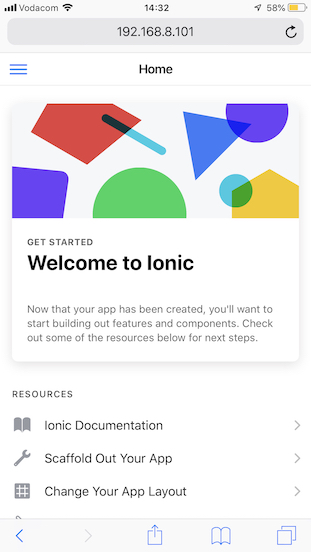

# firebase-ionic
Applications built with Firebase and Ionic technology

# Instructions

## Git
* Set up a new Git (GitHub) repo
* Clone the repo to your local machine

```
git clone https://github.com/rennay<repo_name>.git
```

## Ionic

### Set Up

* [Install npm](https://www.npmjs.com/get-npm)
* Install ionic package
```
npm install -g ionic
```
* Create your Ionic project

```
ionic start <project> <format> --type=angular
```
* Example:
```
ionic start myApp sidemenu
ionic start myApp tabs
```
* Fire up your ionic project

```
cd myApp
ionic serve
```
* Wait until you see
```
...
[ng] ℹ ｢wdm｣: Compiled successfully.
```

### Testing

One of the most rewarding aspects is to actually *see* something tangible.  Fortunately, with Ionic, you're now at a point where you can actually view something and also get a feel for the App you're trying to build.

#### Browser
* As part of the Ionic start, a browser window should have opened - but in case it didn't, navigate to the following URL:
```
http://localhost:8100
```


#### Machine/Device on your local network
* If you want to see how it renders from another machine or your mobile device, make sure that device and the computer where you started Ionic is on the same network.  Find the IP address of that machine (x.x.x.x) and navigate to:
```
http://<x.x.x.x>:8100
```




#### Ionic Devapp


## Firebase