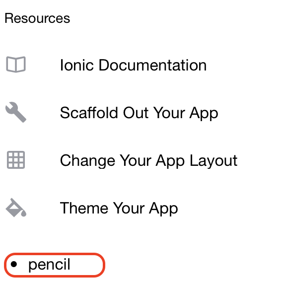
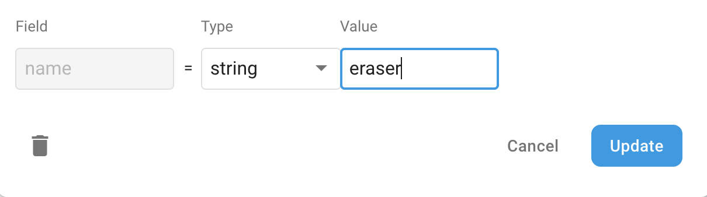
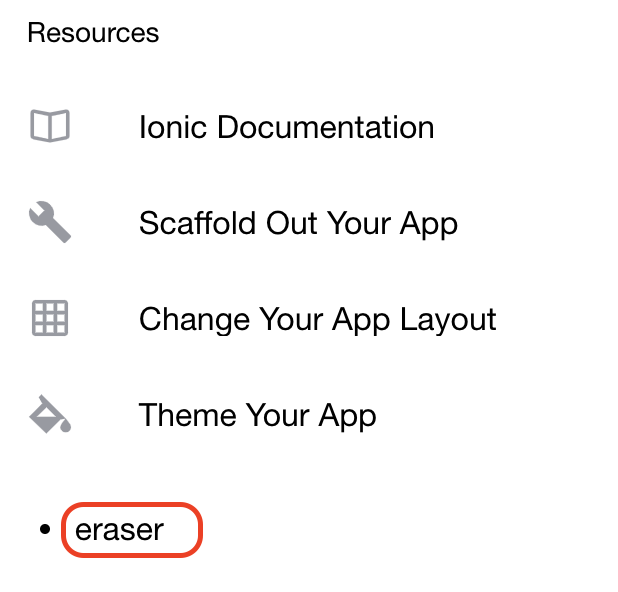
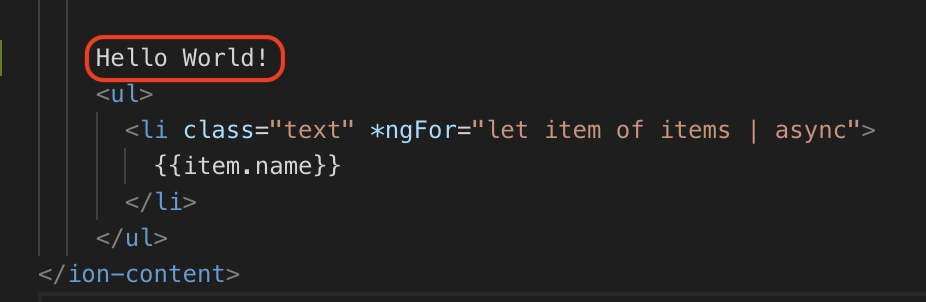
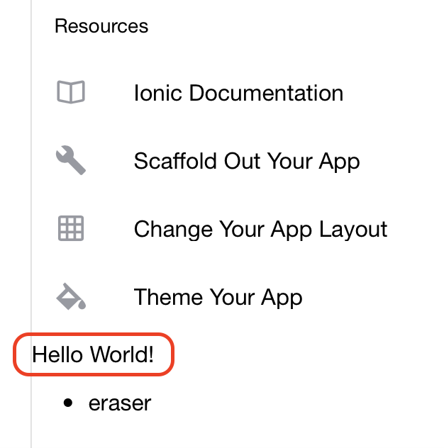

# AngularFire

## 1. Installation

* Install AngularFire from npm

```
npm install firebase @angular/fire --save
```

## 2. Configuration

The following has been adapted from the [AngularFire Installation and Setup Page](https://github.com/angular/angularfire2/blob/master/docs/install-and-setup.md)

### 2.1. Add Firebase config to environments variable

Open /src/environments/environment.ts and add your Firebase configuration. We found the project configuration in [Firebase Setup](firebase_setup.md).

```javascript
export const environment = {
  production: false,
  firebase: {
      apiKey: "<your-key>",
      authDomain: "<your-project-authdomain>",
      databaseURL: "<your-database-URL>",
      projectId: "<your-project-id>",
      storageBucket: "<your-storage-bucket>",
      messagingSenderId: "<your-messaging-sender-id>"
  }
};
```

### 2.2. Setup @NgModule for the AngularFireModule

Open /src/app/app.module.ts, inject the Firebase providers, and specify your Firebase configuration.

* Add the following imports:
```javascript
import { AngularFireModule } from '@angular/fire';
import { environment } from '../environments/environment';
```

* Add the following into:

```javascript

@NgModule({
  declarations: [AppComponent],
  entryComponents: [],
  imports: [
      ...
    // Firebase modules
    AngularFireModule.initializeApp(environment.firebase, 'my-app-name'), // imports firebase/app needed for everything
  ]
```

### 2.3. Setup individual @NgModules

For this tutorial, we will only need the following module(s):

* AngularFirestoreModule

Add the following imports to /src/app/app.module.ts -

```javascript
import { AngularFirestoreModule } from '@angular/fire/firestore';
```

* Add the following into:

```javascript

@NgModule({
  declarations: [AppComponent],
  entryComponents: [],
  imports: [
      ...
    // Firebase modules
    AngularFirestoreModule, // imports firebase/firestore, only needed for database features
  ]
```
* Your /src/app/app.module.ts *should* look like the following:

```javascript
import { NgModule } from '@angular/core';
import { BrowserModule } from '@angular/platform-browser';
import { RouteReuseStrategy } from '@angular/router';

import { IonicModule, IonicRouteStrategy } from '@ionic/angular';
import { SplashScreen } from '@ionic-native/splash-screen/ngx';
import { StatusBar } from '@ionic-native/status-bar/ngx';

import { AppComponent } from './app.component';
import { AppRoutingModule } from './app-routing.module';

import { AngularFireModule } from '@angular/fire';
import { AngularFirestoreModule } from '@angular/fire/firestore';
import { environment } from '../environments/environment';
@NgModule({
  declarations: [AppComponent],
  entryComponents: [],
  imports: [
    BrowserModule,
    IonicModule.forRoot(),
    AppRoutingModule,
    // Firebase modules
    AngularFireModule.initializeApp(environment.firebase, 'my-app-name'), // imports firebase/app needed for everything    
    AngularFirestoreModule
  ],
  providers: [
    StatusBar,
    SplashScreen,
    { provide: RouteReuseStrategy, useClass: IonicRouteStrategy }
  ],
  bootstrap: [AppComponent]
})
export class AppModule {}
```
> Milestone: You've configured AngularFire and Ionic to co-exist with each other.

## 3. Testing - Bind a Firestore collection to a list

### 3.1. Inject AngularFirestore
Open /src/app/home/home.page.ts and add the following:

* Imports

```javascript
import { AngularFirestore } from '@angular/fire/firestore';
import { Observable } from 'rxjs';
```

* Constructor

```javascript
export class HomePage {
  items: Observable<any[]>;
  constructor(db: AngularFirestore) {
    this.items = db.collection('items').valueChanges();
  }
}
```

In /src/app/home/home.page.html, add the following before the **ion-content** tag -
```
<ul>
  <li class="text" *ngFor="let item of items | async">
    {{item.name}}
  </li>
</ul>
```

### 3.2. Run your app
ng serve

### 3.3 Viewing Firebase data

* If all goes well, you should see the following:



> Milestone: This is a major one! You can see Firestore data in your Ionic Application.

### 3.4 Changing Firestore data

* Now, with your Ionic app still running, update the value of *pencil* in Firestore to *eraser*



* If you switch back to your browser, you will see that the page has updated - and without a refresh!



> Milestone: Firestore updates ripple through to Ionic

### 3.5 Changing Ionic data

* Update src/app/home/home.page.html



* If you switch back to your browser, you will see that the page has updated - and without a refresh!



* This is incredible as it means you don't have to restart your Application if you make any code/data changes

> Milestone: Congratulations! You've come a long way.  Take a bow.


